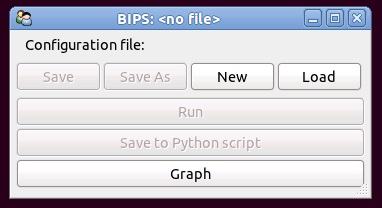
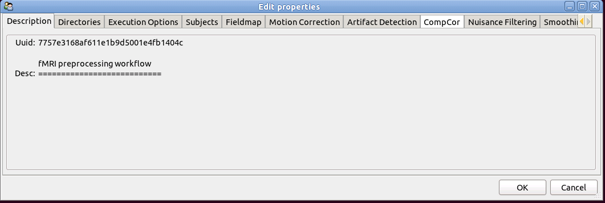
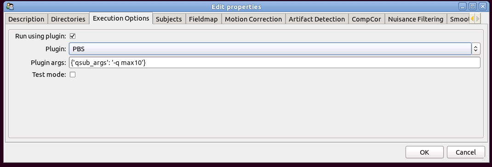
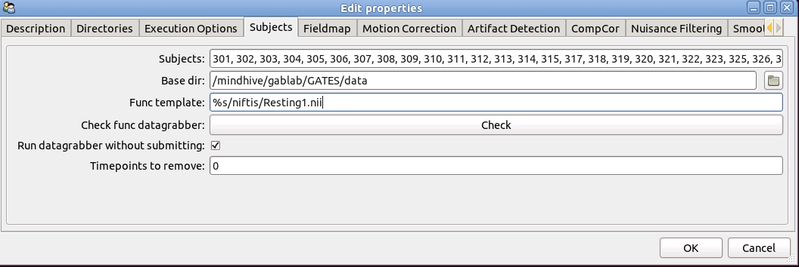
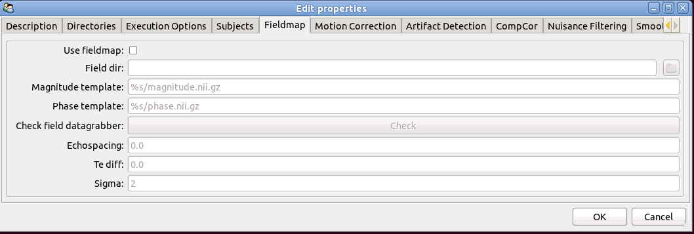
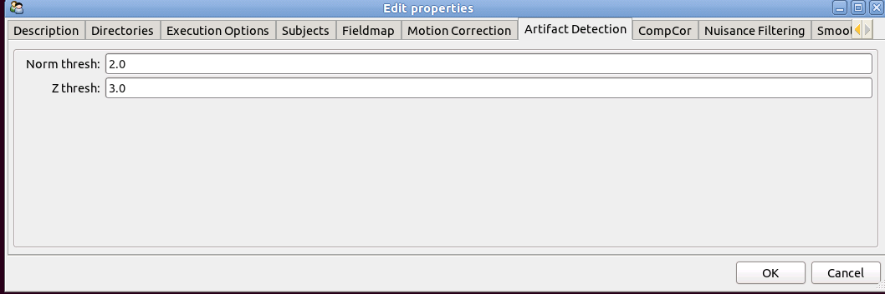
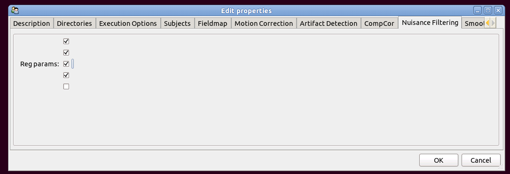

==========================================
Preprocessing Resting State Data Tutorial
==========================================

This tutorial will explain how to use the BIPS user interface to preprocess resting state data. The same workflow can be used for preprocessing task-fMRI data, but the user will need to choose different options on some steps. 

Start BIPS
----------

To list all bips workflows type:

>>> bips -l

You will see a list of UUID's and their associated workflows. For preprocessing resting state data, you want uuid 7757e3168af611e1b9d5001e4rb1404c. You only need to type in the first 3-4 characters of the UUID to bring up the workflow user interface.

To open this workflow type:

>>> bips -c 77

 
* Click 'new' to open a new configuration file
* Click 'load' to open a pre-existing configuration file and navigate to where you saved your desired file
* Configuration files are stored in JSON format so you can edit your configuration file in any text editor.
* Name your configuration file with the suffix'.json'

Description
-----------
The description tab should show:

* The description tab tells you the name of the workflow you have opened with the workflow description. Verify that this is the correct workflow.

Directories
-----------
The Directories tab shows:

* Working dir : This is the working directory where nipype_ stores all the intermediate files and cache information of your workflow. Once your analysis is complete you can delete the working directory because the results are saved in the sink directory. If you change some configuration parameters and re-run the workflow, only the steps that have changed parameters will run.
* Sink dir : This is the output directory of your data - it will be organized by subject id and will have the outputs listed in the workflow description_.
* Crash dir : This is the directory where the crash files will be stored
* Surf dir : This is the freesurfer SUBJECTS_DIR. 

.. admonition:: IMPORTANT!

   The subject ID's in the Freesurfer directory MUST match the subject ID's in the subjects_ tab.

.. _description: workflows/generated/uuid_ 7757e3168af611e1b9d5001e4rb1404c.html

Execution Options
-----------------
The 'Execution Options' tab lets you choose how you want the program to run.

* Run using plugin : Selecting this option run the workflow using the plugin specifed below. For more informaton on what the plugin options mean, go to the nipype website on plugins_.

.. _plugins: http://nipy.sourceforge.net/nipype/users/plugins.html

* Plugin args : arguments to the plugin engine
* Test mode : select if you want to test the puline with one subject.

Subjects
--------
This is where you will enter the subjects that you want to run in your analysis.

.. _subjects: 

* Subjects : Enter the subject IDs
* Base dir: The base directory where the subject nifti files are located
* Func template: Template to locate each subjects functional runs. See template examples_
* Check func datagrabber: click here to make sure that your files exist where you told the program they live.
* Run datagrabber without submitting: click here if you want your program to grab your data locally instead of running on the cluster.
* Timpoints to remove: enter any volumes you don't want to preprocess here.

.. _examples:
.. admonition:: Functional Template Examples

   Let us assume that our directory structure is as follows:

   * /base/directory/
     
     * sub01

       * BOLD

         * BOLD001.nii.gz
         * BOLD002.nii.gz
         * BOLD003.nii.gz
     
     * sub02

       * BOLD

         * BOLD001.nii.gz

   We want to preprocess all 3 BOLD niftis for each subject, so we want BIPS to grab:
     
   * /base/directory/sub01/BOLD/BOLD001.nii.gz
   * /base/directory/sub01/BOLD/BOLD002.nii.gz
   * /base/directory/sub01/BOLD/BOLD003.nii.gz

   In the "Base dir" field we write /base/directory or navigate there by clicking the folder button to the right. Some valid functional templates are:

   * %s/BOLD/BOLD00?.nii.gz
   * %s/BOLD/BOLD*.nii.gz

   The '%s' will be replaced by each subject id in the "Subjects" field. These ID's MUST match the ID in the SUBJECTS_DIR of freesurfer.

   Suppose we only want the 1st and 3rd functional run. A valid template is:

   * %s/BOLD/BOLD00[1,3].nii.gz

Fieldmap
^^^^^^^^
Using fieldmap correction is optional. If fieldmap scans were not collected, make sure to deselect "Use fieldmap" option.

* Use fieldmap: click here if you want to run fieldmap correction.
* Field dir: This is the base directory for the fieldmap scans.
* Magnitude template: enter the template to locate magnitude images. See template examples_ for more information
* Phase template: enter where your template to locate phase images. See template examples_ for more information.
* Check field datagrabber: This function checks the validity of the magnitude and phase templates.
* Echospacing: Specify the echo spacing of the acquisition
* Te diff: Specify the TE diff of the acquisition
* Sigma: Fieldmap smoothing - BIPS default is 2mm .

Motion Correction
^^^^^^^^^^^^^^^^^
Enter your motion correction parameters here:

.. image:: bips_images/Motion_correction.png
   :scale: 75%

* do despike: Run AFNI's despike before motion correction to correct for scanner intensity inhomogeneities 
* Motion correct node: choose the motion correction algorithm to use
  
  * Nipy_
  * FSL_
  * SPM_
  * AFNI_

.. _FSL: http://www.fmrib.ox.ac.uk/fsl/mcflirt/index.htmlspm
.. _SPM: http://www.ncbi.nlm.nih.gov/pubmed/22036679
.. _AFNI: http://www.personal.reading.ac.uk/~sxs07itj/web/AFNI_motion.html

* Tr: Repetition time of acquisition
* Do slicetiming: select to run slice-timing correction
* Use metadata: select ONLY if you used dcmstack_ to convert dicoms. BIPS will extract the slice-order and the TR from the nifti header.
* Slice order: 0 based slice order
* Loops: parameter for nipy realignment. Default = 5
* Speedup: parameters for nipy realignment. Default = 5.5

Artifact Detection
^^^^^^^^^^^^^^^^^^
Artifact detection parameters are specified here:

* Norm thresh: threshold used to detect motion-related outliers for composite motion.
* Z thresh: threshold used to detect images that deviate from the mean.

CompCor
^^^^^^^
CompCor_

.. _Compcor: http://www.sciencedirect.com/science/article/pii/S1053811907003837.

* Compcor select: Although the selection boxes aren't labelled, they represent (in the order specified) running:

  #.  T-compcor: Timeseries of voxels with the highest variance
  #.  A-compcor: Timeseries of voxels in the CSF and white matter

  A principal component analysis is run on the selected timeseries. Both A and T compcor may be selected.

* Num noise components: Number of components to keep from the principal component analysis. 6 is recommended.
* Regress before PCA: An alternative CompCor method - regresses motion and artifacts BEFORE running principal component analysis.

Nuisance Filtering
------------------
Choose the components to regress from the time series:

* Reg params: The unlabelled selection boxes represent (in the order specified below):

  #. Regress motion parameters
  #. Regress norm components from artifact detection
  #. Regress noise components from CompCor
  #. Regress outliers
  #. Regress motion derivaties

.. admonition:: For task fMRI

   Do NOT select any parameters to regress from the timeseries! This is done in first-level modeling.

Smoothing
---------

Enter smoothing parameters:

* Smooth type: Smoothing algorithm to run

  * Susan_
  * Isotropic: isotropic smoothing from fslmaths
  * Freesurfer_

.. _Susan: http://nipy.sourceforge.net/nipype/interfaces/generated/nipype.interfaces.fsl.preprocess.html#susan
.. _Freesurfer: http://nipy.sourceforge.net/nipype/interfaces/generated/nipype.interfaces.freesurfer.preprocess.html#smooth

* Fwhm: Full width half max in mm
* Surface fwhm: surface smoothing kernel (used if Freesurfer smoothing is selected).

Bandpass Filter
---------------

Enter filtering parameters:

Advanced Options
----------------

This tab allows the user to write python code that is executed before the workflow runs. This is a good opportunity for advanced users to re-wire the preprocessing workflow. 

Run the Workflow
----------------

Once all the parameters are entered, click "Ok" then "Save" and "Run".

Crashes
-------

Unfortunately workflows do not always run cleanly. If you see an error message, navigate to your crash directory and open a crashfile by typing

>>> nipype_display_crash <crashfile>

Often errors occur when

* Your environment is not correctly set up. Make sure all the necessary dependencies are set in the PATH and/or PYTHONPATH variables.
* BIPS cannot locate the data - verify the information in the "subjects" tab is correct
* There may be a problem with the plugin. Try running the workflow in test_mode without using a plugin.

If you are unable to understand the error message, post the message under the "Issues" tab in the `BIPS github repository`__.

.. __: https://github.com/akeshavan/BrainImagingPipelines

Next Steps
----------

Once the workflow succesfully finishes, check your sink directory to make sure all the outputs are there. You can now run the following workflows:

* `Quality Assurance`__

.. __: workflows/generated/uuid_5dd866fe8af611e1b9d5001e4fb1404c.html

* `Resting State QA`__

.. __: workflows/generated/uuid_62aff7328b0a11e1be5d001e4fb1404c.html

* `Normalization with ANTS`__

.. __: workflows/generated/uuid_3a2e211eab1f11e19fab0019b9f22493.html

* `Import files to Conn`__

.. __: workflows/generated/uuid_19d774a8a36111e1b495001e4fb1404c.html

