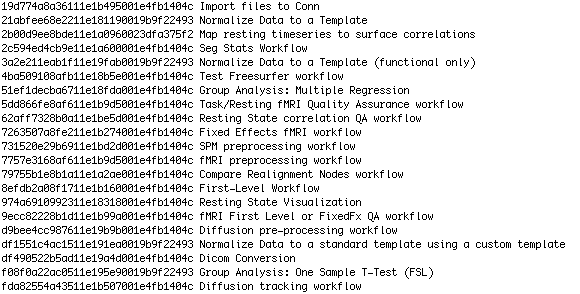
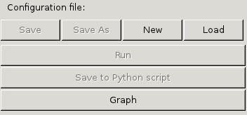
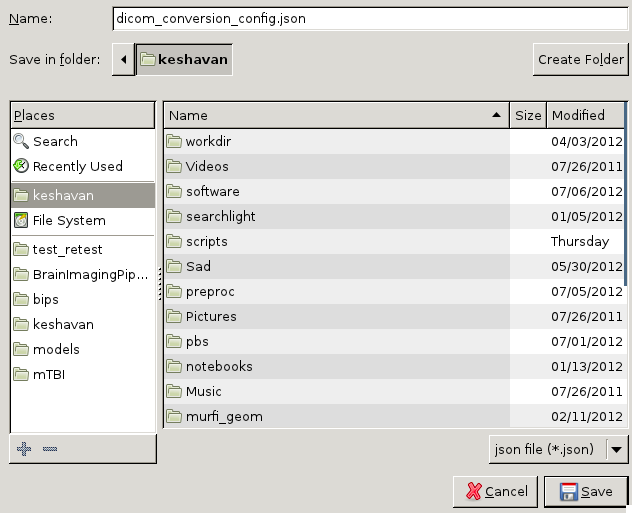
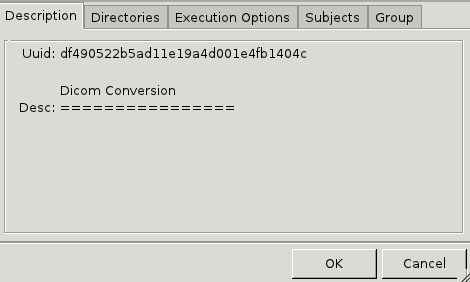
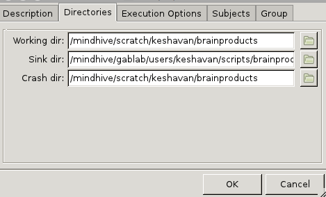
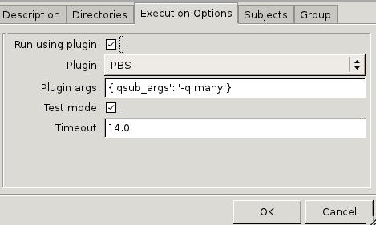
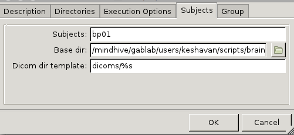
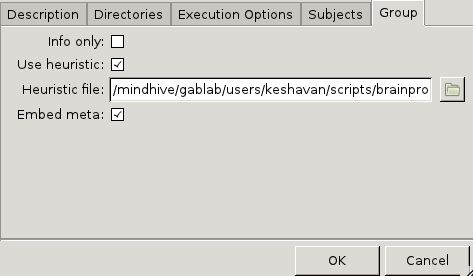
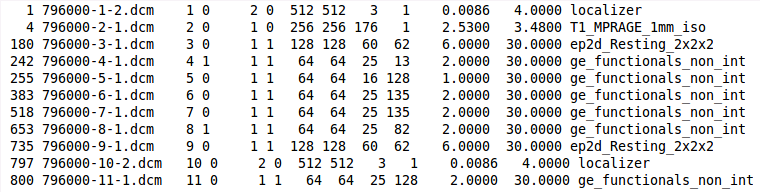

===============
Getting Started
===============
This tutorial will explain how to start BIPS and use the user interface, then show how to convert dicoms using the BIPS Dicom Convert workflow. 

BIPS uses a dicom converter written in Python, called dcmstack_. Dcmsctack embeds meta-data from dicoms into niftis. This is very useful for later processing steps and can avoid inputting wrong information. For example, in preprocessing the slice-order and TR are embedded within the nifti, so you won't have to type it in.

BIPS also gives you the flexibility to reorganize and rename your dicoms any way you choose by writing a heuristic_ python script. 

.. _dcmstack: https://github.com/moloney/dcmstack

Listing Workflows
-----------------

To list all the BIPS workflows, type

>>> bips -l

You will see a list of UUID's and their associated workflows.

To open a workflow, type

>>> bips -c <first 3-4 digits of the UUID>

Dicom Conversion
----------------

Open the Dicom Conversion workflow with

>>> bips -c df4

A window will pop up, as shown in the figure below:

Click 'New' to create a new configuration file. Configuration files are stored in JSON format, so you can edit your configuration file in any text editor.

Name your configuration file with the suffix '.json'.

First verify that this is the workflow you want to run. Then click the "Directories" tab

.. admonition:: Note 
   
   When you hover your mouse over any field, it will give a description.       

Directories
^^^^^^^^^^^
The directories tab should show: 

* Working dir: This is the working directory where nipype_ stores all the intermediate files and cache-ing information of your workflow. Once your analysis is complete you can delete the working directory because the results are saved in the sink directory.
* Sink dir: This is where nipype_ stores the outputs of your workflow.
* Crash dir: This is the crash directory, where nipype_ will store crash files, in case something goes wrong.

Execution Options
^^^^^^^^^^^^^^^^^
Next you must specify the execution options of the worfklow

* Run using plugin: when selected, nipype will run the workflow using the selected plugin
* Plugin: choose from PBS, PBSGraph, Condor, SGE, MultiProc. For more information see the nipype_ website.
* Plugin args: arguments to the plugin engine.
* Test mode: selecting test mode will run only 1 subject

Subjects
^^^^^^^^

BIPS needs to locate the dicoms for each subject:

* Subjects: Enter each subject's name as a comma seperated list
* Base dir: This is the base directory where BIPS will look for each subject's data
* Dicom dir template: This is the template for the subject's dicom directory. The '%s' will be replaced by each subject in the list of subjects. In this example, BIPS will find the dicoms in the folder /mindhive/gablab/users/keshavan/scripts/brainproducts/dicoms/bp01. 

Group
^^^^^

In the last tab, 'Group':

* Info only: Selecting this will NOT convert your dicoms. It will just make a dicominfo.txt file that summarizes the contents in your dicom directory. This is useful for making a heuristic_ file to name and sort your dicoms later.
* Use heuristic: Selecting this will tell the workflow to convert and sort your dicoms according to your heuristic_ file. If left unselected the workflow will assign default names based on the dicom headers.
* Heuristic file: The location of your heuristic_ file
* Embed meta: Check this box to embed dicom meta-data to the resulting Niftis. This is highly recommended for later processing steps!

Saving and Running
^^^^^^^^^^^^^^^^^^

Click 'OK', then save, then Run. 

.. _heuristic:

Creating a Heuristic file
^^^^^^^^^^^^^^^^^^^^^^^^^
To begin, fill in the "Directories", "Execution Options", "Subjects" tabs in the dicom convert interface. Under "Group" select "Info Only", then save and run the workflow. Navigate to the Sink dir you specified in the configuration. You should see a folder for each subject you specified in the "Subjects" tab. For this tutorial we navigate tp subject bp01's folder

>>> cd bp01
>>> less dicominfo.txt

Our dicominfo file shows:

If we choose not to use a heuristic file, the dicom conversion workflow will create 11 dicoms, starting with:

* 1-localizer.nii.gz
* 2-T1_MPRAGE_2mm_iso.nii.gz
* 3-ep2d_Resting_2x2x2.nii.gz

up to

* 11-ge_functionals_non_int.nii.gz

But in this example, we don't want to convert the localizer and we want to rename the MPRAGE to 'anatomy', the ep2d_Resting_2x2x2 to 'resting' and we want the non-MoCo ge_functionals_non_int runs to be converted. Our heuristic file looks like:

.. testcode::
   
   def infotodict(sdir, dicominfofile):
       from bips.workflows.workkflow19 import isMoco #this is a function that checks if a run was motion corrected
       import numpy as np
       from glob import glob
       import os
       seq = np.genfromtxt(dicominfofile,dtype=object)  #the dicominfo.txt file is imported
       info = dict(bold=[], resting=[], mprage=[]) #build a dictionary called "info" with keys that will name our nifits
       for s in seq:
            x,y,sl,nt = (int(s[6]),int(s[7]),int(s[8]),int(s[9]))
            if 'MPRAGE' in s[12]:
                info['mprage'].append(int(s[2]))
            elif  (('bold' in s[12]) or ('func' in s[12])):
                if not isMoco(glob(os.path.join(sdir,s[1]))[0]):
                    info['bold'].append(int(s[2]))
            elif  'Resting' in s[12]:
                info['resting'].append(int(s[2]))
            else:
                pass
       return info
   
.. admonition:: Note
   
   NOTE: It is important that the function is named 'infotodict' and that it takes in 2 parameters, 'sdir' and 'dicominfofile' even if the parameters aren't all used. 'sdir' is the subject's dicom directory and 'dicominfofile' is our dicominfo.txt file

The resulting directory structure looks like:

* bp01

  * mprage

    * mprage001.nii.gz

  * bold

    * bold001.nii.gz

  * resting

    * resting.nii.gz

Remember that the function should be written in a way that it correctly sorts the runs for all subject's dicominfo files.

.. include:: links_names.txt
